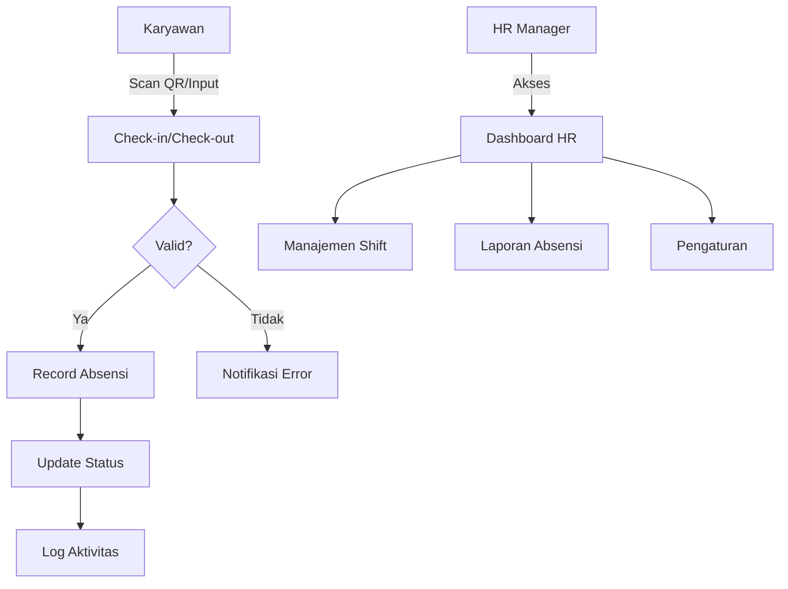
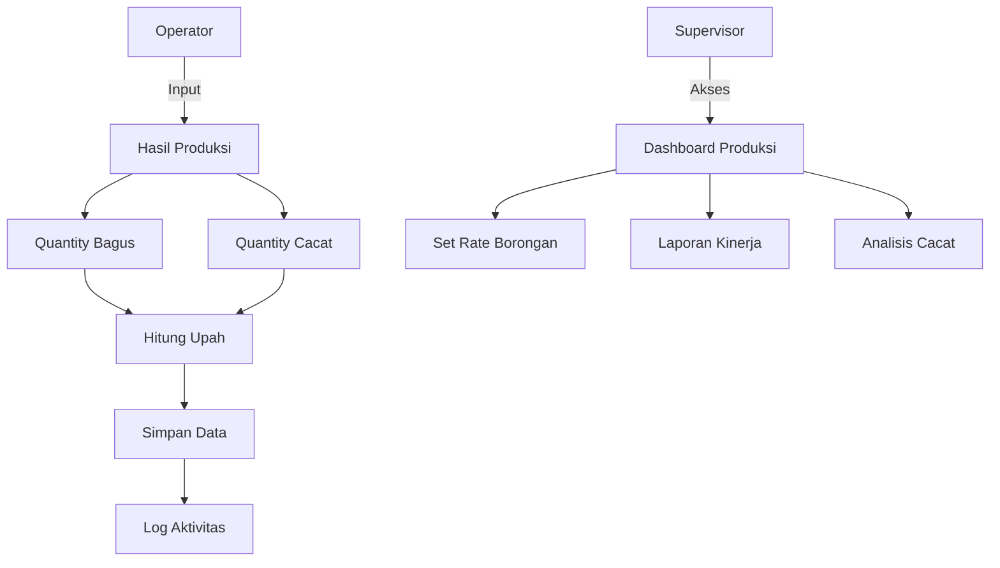
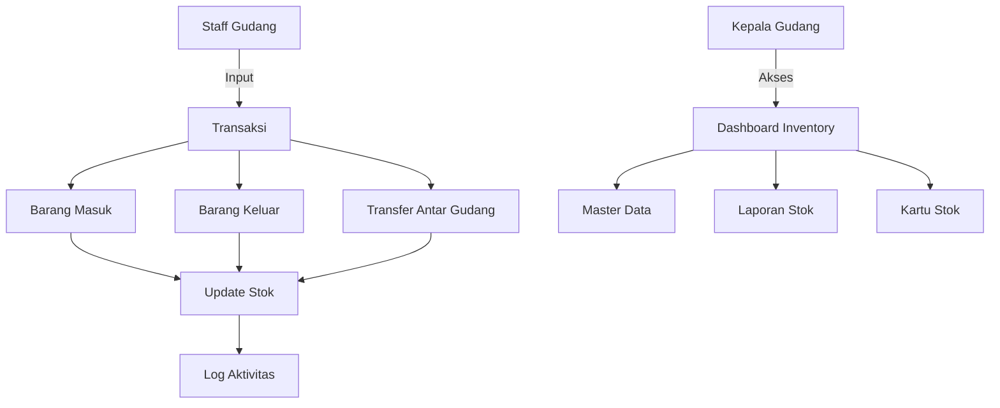

# Sistem Manajemen Pabrik

## Diagram Alur Aplikasi

### 1. Modul HR/Absensi


### 2. Modul Produksi/Borongan


### 3. Modul Gudang/Inventory


## Route dan Fitur

### 1. Modul HR/Absensi
- **Route Prefix**: `/hr`
- **Route List**:
  ```php
  // Absensi
  hr.attendance.scan          // Form scan absensi
  hr.attendance.process-scan  // Proses scan absensi
  hr.attendance.index         // Daftar absensi
  hr.attendance.report        // Laporan absensi
  
  // Shift
  hr.shifts.index            // Daftar shift
  hr.shifts.create           // Tambah shift baru
  hr.shifts.edit            // Edit shift
  hr.shifts.delete          // Hapus shift
  ```

### 2. Modul Produksi/Borongan
- **Route Prefix**: `/production`
- **Route List**:
  ```php
  // Input Hasil
  production.piecework.create    // Form input hasil
  production.piecework.store     // Simpan hasil
  production.piecework.index     // Daftar hasil
  production.piecework.report    // Laporan hasil
  
  // Rate Borongan
  production.rates.index         // Daftar rate
  production.rates.create        // Tambah rate
  production.rates.edit          // Edit rate
  production.rates.delete        // Hapus rate
  ```

### 3. Modul Gudang/Inventory
- **Route Prefix**: `/inventory`
- **Route List**:
  ```php
  // Transaksi
  inventory.in.create           // Form barang masuk
  inventory.in.store            // Simpan barang masuk
  inventory.out.create          // Form barang keluar
  inventory.out.store           // Simpan barang keluar
  inventory.transfer.create     // Form transfer
  inventory.transfer.store      // Simpan transfer
  
  // Master Data
  inventory.items.index         // Daftar barang
  inventory.warehouses.index    // Daftar gudang
  inventory.uoms.index          // Daftar satuan
  
  // Laporan
  inventory.stock-card         // Kartu stok
  inventory.report             // Laporan inventory
  ```

### 4. Modul Log Aktivitas
- **Route Prefix**: `/logs`
- **Route List**:
  ```php
  logs.index                   // Daftar log
  logs.show                    // Detail log
  logs.export                  // Export log
  ```

## Role dan Permissions

### 1. Admin
- Akses penuh ke semua modul
- Manajemen user dan role
- Konfigurasi sistem

### 2. HR Manager
- Manajemen absensi
- Pengaturan shift
- Laporan HR

### 3. Production Manager
- Pengaturan rate borongan
- Monitoring hasil produksi
- Laporan produksi

### 4. Warehouse Manager
- Manajemen inventory
- Approval transfer
- Laporan gudang

### 5. Staff
- Input absensi
- Input hasil produksi
- Input transaksi gudang

## Fitur Log dan Audit Trail
- Log semua aktivitas CRUD
- Tracking perubahan data
- Record user, waktu, dan IP
- Export log ke CSV

## Alur Kerja Aplikasi

1. **Absensi Harian**
   - Karyawan scan untuk check-in/out
   - Sistem record waktu dan status
   - Update dashboard HR

2. **Input Hasil Produksi**
   - Staff input quantity hasil
   - Sistem hitung upah
   - Update laporan kinerja

3. **Manajemen Inventory**
   - Staff input transaksi
   - Sistem update stok
   - Generate kartu stok

4. **Monitoring dan Laporan**
   - Dashboard real-time
   - Laporan periodik
   - Analisis kinerja

## Panduan Penggunaan Route

1. **Format Route**
   ```php
   {module}.{resource}.{action}
   ```

2. **Contoh Penggunaan**
   ```php
   // Absensi
   Route::get('/hr/attendance/scan', [AttendanceController::class, 'scanForm'])->name('hr.attendance.scan');
   
   // Produksi
   Route::post('/production/piecework', [PieceworkController::class, 'store'])->name('production.piecework.store');
   
   // Inventory
   Route::get('/inventory/stock-card/{item}', [InventoryController::class, 'stockCard'])->name('inventory.stock-card');
   ```

3. **Middleware**
   ```php
   middleware(['auth', 'role:permission_name'])
   ```

## Catatan
- Semua route memerlukan autentikasi
- Akses berdasarkan role dan permission
- Semua aktivitas tercatat di log
- Export data tersedia untuk semua laporan